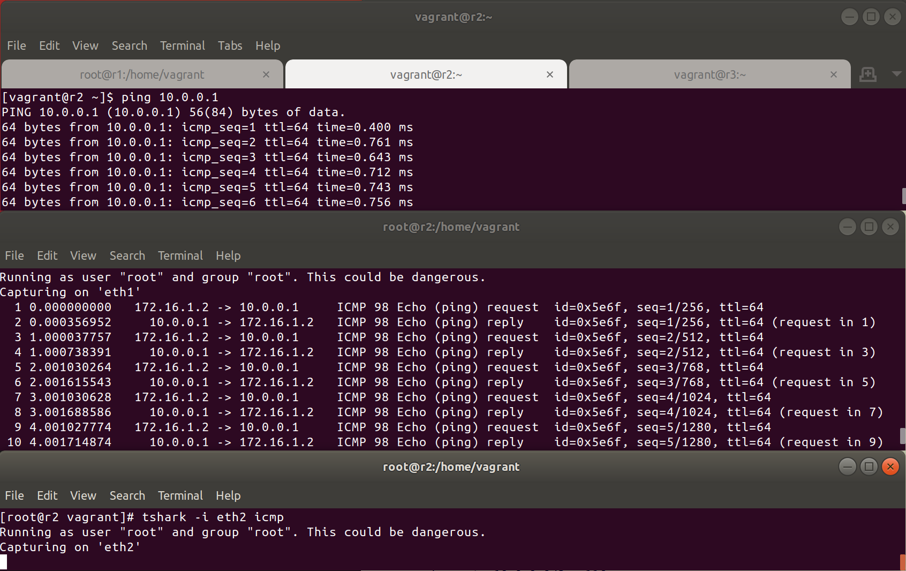

# Домашнее задание OSPF

## Схема сети


Таблица соответствия каналов и адресов.  
| Канал | Адресация |
|-------|-----------|
| ISP   | DHCP client    |
| link1 | 172.16.1.0/24 |
| link2 | 172.16.2.0/24 |
| link3 | 172.16.3.0/24 |
  
Таблица адресов на интерфейсах устройств.  
| Устройство | Интерфейс | Адрес |
|------------|-----------|-------|
| R1 | lo | 10.0.0.1/32 | 
| R1 | eth0 | vagrant DHCP | 
| R1 | eth1 | 172.16.1.1/24 |
| R1 | eth2 | 172.16.2.1/24 | 
| R2 | lo | 10.0.0.2/32 | 
| R2 | eth0 | vagrant DHCP | 
| R2 | eth1 | 172.16.1.2/24 |
| R2 | eth2 | 172.16.3.2/24 | 
| R3 | lo | 10.0.0.3/32 |
| R3 | eth0 | vagrant DHCP | 
| R3 | eth1 | 172.16.2.3/24 |
| R3 | eth2 | 172.16.3.3/24 | 

## Ассиметричная маршрутизация

После развертывания стенда, на нем настроена ассиметричная маршрутизация для r2 (увеличена стоимость eth1)


## Восстановление симертичной маршрутизации

Для восстановления симметричной маршрутизации установим статический маршрут на r2:

```
vtysh
conf t
ip route 10.0.0.1/32 eth1
```


